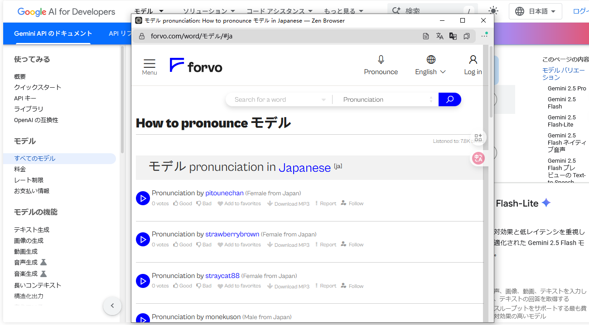

# Forvo发音弹窗

[](https://opensource.org/licenses/MIT)
[](https://github.com/yourusername/ForvoPopup)
[](https://www.tampermonkey.net/)

一个智能的浏览器用户脚本，让您可以通过简单的快捷键操作，快速查看选中单词在Forvo上的发音。支持英语和日语的自动语言识别，提供响应式弹窗体验。

## ✨ 特性

- 🎯 **智能语言识别**: 自动检测选中文本是英语还是日语
- ⌨️ **便捷快捷键**: 使用 `Ctrl + Alt` 组合键快速触发
- 📱 **响应式设计**: 适配桌面、平板和移动设备
- 🚀 **轻量高效**: 纯JavaScript实现，无外部依赖
- 🌐 **全站兼容**: 在任何网站上都能使用
- 🎨 **优雅动画**: 流畅的弹窗动画效果



## 🚀 快速开始

### 安装要求

- 浏览器扩展管理器（推荐 [Tampermonkey](https://www.tampermonkey.net/)）
- 支持现代JavaScript的浏览器

### 安装步骤

1. **安装Tampermonkey扩展**
   - Chrome: [Chrome Web Store](https://chrome.google.com/webstore/detail/tampermonkey/dhdgffkkebhmkfjojejmpbldmpobfkfo)
   - Firefox: [Firefox Add-ons](https://addons.mozilla.org/en-US/firefox/addon/tampermonkey/)
   - Edge: [Microsoft Store](https://microsoftedge.microsoft.com/addons/detail/tampermonkey/iikmkjmpaadaobahmlepeloendndfphd)

2. **安装脚本**
   ```bash
   # 方法1: 直接安装
   # 点击 forvo-popup.user.js 文件，Tampermonkey会自动识别并提示安装
   
   # 方法2: 手动安装
   # 复制 forvo-popup.user.js 的内容到Tampermonkey的新脚本中
   ```

3. **启用脚本**
   - 在Tampermonkey管理面板中确保脚本已启用
   - 刷新您想要使用的网页

## 📖 使用方法

1. **选择文本**: 在任何网页上选中您想要查询发音的单词或短语
2. **触发查询**: 按下 `Ctrl + Alt` 组合键
3. **查看发音**: 系统会自动打开Forvo发音页面的弹窗

### 支持的语言

- **英语**: 自动识别英文单词和短语
- **日语**: 支持平假名、片假名、汉字和日式标点符号

### 使用示例

```
选中文本: "hello"     → 打开英语发音页面
选中文本: "こんにちは"  → 打开日语发音页面
选中文本: "世界"      → 打开日语发音页面
```

## 🛠️ 技术实现

### 核心功能

- **语言检测算法**: 基于Unicode字符范围的智能识别
- **响应式布局**: 根据屏幕尺寸动态调整弹窗大小
- **URL构建**: 自动编码并构建Forvo查询链接

### 代码结构

```javascript
// 主要功能模块
├── 语言检测 (detectLanguage)
├── URL构建 (buildForvoUrl)  
├── 弹窗创建 (createForvoPopup)
├── 事件处理 (handleKeyDown)
└── 样式注入 (CSS animations)
```

## ⚙️ 配置选项

脚本支持以下自定义配置：

| 参数 | 默认值 | 说明 |
|------|--------|------|
| 最大文本长度 | 50字符 | 防止查询过长的文本 |
| 弹窗尺寸 | 响应式 | 根据设备自动调整 |
| 动画效果 | 启用 | 淡入和缩放动画 |

## 🔧 开发

### 本地开发

```bash
# 克隆仓库
git clone https://github.com/yourusername/ForvoPopup.git
cd ForvoPopup

# 编辑脚本
# 使用您喜欢的编辑器修改 forvo-popup.user.js

# 测试
# 在Tampermonkey中重新加载脚本进行测试
```

### 自定义修改

如需修改脚本行为，可以编辑以下部分：

```javascript
// 修改快捷键组合
if (e.ctrlKey && e.altKey) { // 改为其他组合键

// 修改弹窗尺寸
popupWidth = Math.min(screenWidth * 0.6, 800); // 调整比例

// 添加新语言支持
function detectLanguage(text) {
    // 添加您的语言检测逻辑
}
```

## 🤝 贡献

欢迎贡献代码！请遵循以下步骤：

1. Fork 本仓库
2. 创建特性分支 (`git checkout -b feature/AmazingFeature`)
3. 提交更改 (`git commit -m 'Add some AmazingFeature'`)
4. 推送到分支 (`git push origin feature/AmazingFeature`)
5. 开启 Pull Request

## 📝 更新日志

### v1.0 (当前版本)
- ✅ 基础功能实现
- ✅ 英语和日语语言检测
- ✅ 响应式弹窗设计
- ✅ 快捷键支持

## 📄 许可证

本项目采用 MIT 许可证 - 查看 [LICENSE](LICENSE) 文件了解详情。

## 🙏 致谢

- [Forvo](https://forvo.com/) - 提供优质的发音数据库
- [Tampermonkey](https://www.tampermonkey.net/) - 强大的用户脚本管理器

---

<div align="center">
  <p>如果这个项目对您有帮助，请给它一个 ⭐️</p>
  <p>Made with ❤️ by [Your Name]</p>
</div>
