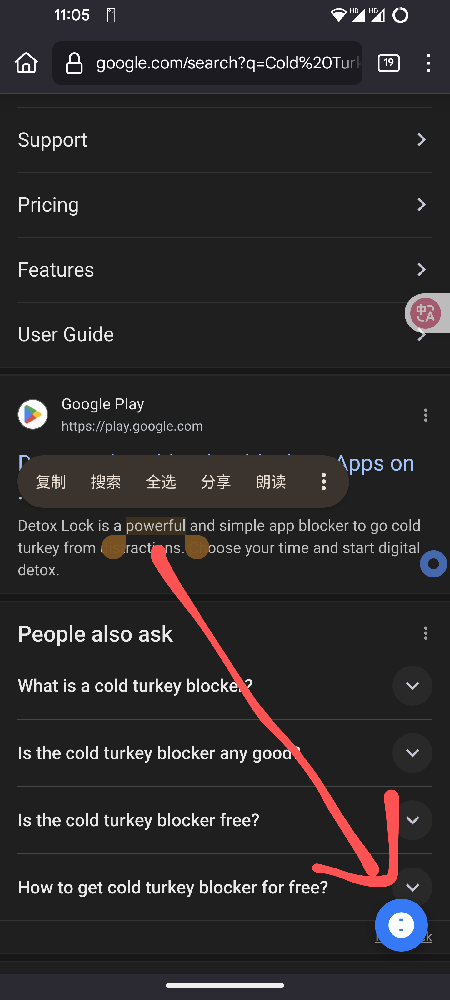

# Forvo发音弹窗

[](https://opensource.org/licenses/MIT)
[](https://github.com/yourusername/ForvoPopup)
[](https://www.tampermonkey.net/)

一个智能的浏览器用户脚本，让您可以通过简单的快捷键操作，快速查看选中单词在Forvo上的发音。支持英语和日语的自动语言识别，提供响应式弹窗体验，并可合并下载所有音频文件。智能音量标准化：自动将低音量mp3提升至标准音量，高音量mp3降至标准音量，并支持智能重复播放。

## ✨ 特性

- 🎯 **智能语言识别**: 自动检测选中文本是英语还是日语
- ⌨️ **便捷快捷键**: 桌面端使用 `Ctrl + Alt + F` 组合键快速触发
- 📱 **移动端支持**: 智能检测移动设备，提供浮动按钮交互方式
- 🖥️ **跨平台兼容**: 完美适配桌面、平板和移动设备
- 🚀 **轻量高效**: 纯JavaScript实现，无外部依赖
- 🌐 **全站兼容**: 在任何网站上都能使用
- 🎨 **优雅动画**: 流畅的弹窗动画效果
- 📥 **音频下载**: 可合并下载所有主词条音频文件（含例句，排除同义词）
- 🎵 **智能合并**: 自动将多个音频合并为单个WAV文件
- 🔊 **智能音量标准化**: 自动将低音量mp3提升至标准音量，高音量mp3降至标准音量
- 🔄 **智能重复播放**: 发音较少时自动重复播放（1个发音重复3次，2个发音重复2次）
- 🎯 **精确筛选**: 通过严格的区块限定，只捕获主词条发音，彻底杜绝相关短语干扰

电脑端效果，会打开一个新标签页的窗口：

移动端效果，选择后右下角出现一个按钮，点击后会打开新标签页跳转：


## 🚀 快速开始

### 安装要求

- 浏览器扩展管理器（推荐 [Tampermonkey](https://www.tampermonkey.net/)）
- 支持现代JavaScript的浏览器

### 安装步骤

1. **安装Tampermonkey扩展**
   - Chrome: [Chrome Web Store](https://chrome.google.com/webstore/detail/tampermonkey/dhdgffkkebhmkfjojejmpbldmpobfkfo)
   - Firefox: [Firefox Add-ons](https://addons.mozilla.org/en-US/firefox/addon/tampermonkey/)
   - Edge: [Microsoft Store](https://microsoftedge.microsoft.com/addons/detail/tampermonkey/iikmkjmpaadaobahmlepeloendndfphd)

2. **安装脚本**
   ```bash
   # 方法1: 直接安装
   # 点击 forvo-popup.user.js 文件，Tampermonkey会自动识别并提示安装
   
   # 方法2: 手动安装
   # 复制 forvo-popup.user.js 的内容到Tampermonkey的新脚本中
   ```

3. **启用脚本**
   - 在Tampermonkey管理面板中确保脚本已启用
   - 刷新您想要使用的网页

## 📖 使用方法

### 🖥️ 桌面端使用

1. **选择文本**: 在任何网页上选中您想要查询发音的单词或短语
2. **触发查询**: 按下 `Ctrl + Alt + F` 组合键
3. **查看发音**: 系统会自动打开Forvo发音页面的新窗口

### 📱 移动端使用

1. **选择文本**: 在任何网页上长按并选中您想要查询发音的单词或短语
2. **点击按钮**: 选择文本后，右下角会出现一个浮动的发音按钮
3. **查看发音**: 点击按钮后会在新标签页中打开Forvo发音页面

### 📥 音频下载功能

1. **在Forvo页面**: 当您访问Forvo发音页面时，右上角会自动显示"📥 下载合并音频 (语言)"按钮
2. **一键下载**: 点击按钮即可下载该单词所有主词条的音频文件
3. **智能合并**: 脚本会自动将多个音频合并成一个WAV文件，音频间有0.5秒间隔
4. **精确筛选**: 通过严格的区块限定，只下载主词条和例句的发音，彻底排除同义词和相关词汇
5. **音量标准化**: 自动分析每个音频的音量，将过高或过低的音量调整至标准水平，确保播放效果一致
6. **智能重复**: 当发音数量较少时自动重复播放（1个发音重复3次，2个发音重复2次）
7. **文件命名**: 下载的文件会包含单词名、语言和重复次数信息，如 `hello_en_x3.wav`

### 支持的语言

- **英语**: 自动识别英文单词和短语
- **日语**: 支持平假名、片假名、汉字和日式标点符号

### 使用示例

**桌面端操作**：
```
选中文本: "hello" + Ctrl+Alt+F     → 打开英语发音页面（新窗口）
选中文本: "こんにちは" + Ctrl+Alt+F  → 打开日语发音页面（新窗口）
选中文本: "世界" + Ctrl+Alt+F      → 打开日语发音页面（新窗口）
```

**移动端操作**：
```
长按选中: "hello" → 点击浮动按钮     → 打开英语发音页面（新标签页）
长按选中: "こんにちは" → 点击浮动按钮  → 打开日语发音页面（新标签页）
长按选中: "世界" → 点击浮动按钮      → 打开日语发音页面（新标签页）
```

**音频下载操作**：
```
访问Forvo页面 → 点击"📥 下载合并音频 (en)"按钮 → 自动下载合并的WAV文件
例如: forvo.com/word/hello → 点击下载按钮 → 获得 hello_en_x3.wav 文件
（如果只有1个发音，会重复3次；如果有2个发音，会重复2次；3个及以上发音播放1次）
```

## 🛠️ 技术实现

### 核心功能

- **语言检测算法**: 基于Unicode字符范围的智能识别
- **设备检测**: 自动识别桌面端和移动端设备
- **响应式交互**: 桌面端快捷键，移动端浮动按钮
- **URL构建**: 自动编码并构建Forvo查询链接
- **精确音频筛选**: 通过严格的CSS选择器和DOM区块限定，确保只获取主词条发音
- **智能音量处理**: 改进的RMS音量分析和标准化增益计算，有效处理各种音量水平的音频，避免削波失真
- **自适应重复逻辑**: 根据发音数量智能决定重复次数，优化学习体验

### 代码结构

```javascript
// 主要功能模块
├── 语言检测 (detectLanguage, containsJapanese)
├── 设备检测 (isMobileDevice)
├── URL构建 (buildForvoUrl)
├── 桌面端交互 (handleKeyDown)
├── 弹窗创建 (createForvoPopup)
├── 音频精确获取 (getAllAudioUrls, scrapeSound)
├── 音频下载 (downloadAudio, downloadMergedAudio)
├── 智能音频合并 (mergeAudioFiles, audioBufferToWav)
├── 音量标准化 (calculateNormalizedGains, calculateAudioStats)
├── 下载按钮自动注入 (Forvo页面检测)
├── Base64解码 (base64Decode)
└── 工具函数 (trimChars, isNull, getTargetLanguageFromUrl)
```

## ⚙️ 配置选项

脚本支持以下自定义配置：

| 参数 | 默认值 | 说明 |
|------|--------|------|
| 最大文本长度 | 50字符 | 防止查询过长的文本 |
| 设备检测阈值 | 768px | 屏幕宽度小于此值视为移动设备 |
| 弹窗尺寸 | 800x600 | 桌面端弹窗的默认尺寸 |
| 音频间隔时间 | 0.5秒 | 合并音频时各音频间的间隔 |
| 轮次间隔时间 | 1.0秒 | 重复播放时每轮之间的间隔 |
| 下载超时时间 | 15秒 | 单个音频文件的下载超时限制 |
| 目标RMS音量 | 0.12 | 音频标准化的目标音量水平 |
| 最大增益限制 | 25.0倍 | 音频增益的最大倍数限制 |
| 最小增益限制 | 0.1倍 | 音频增益的最小倍数限制 |
| 重复播放规则 | 1个→3次，2个→2次 | 根据发音数量的智能重复逻辑 |

## 🔧 开发

### 本地开发

```bash
# 克隆仓库
git clone https://github.com/yourusername/ForvoPopup.git
cd ForvoPopup

# 编辑脚本
# 使用您喜欢的编辑器修改 forvo-popup.user.js

# 测试
# 在Tampermonkey中重新加载脚本进行测试
```

### 自定义修改

如需修改脚本行为，可以编辑以下部分：

```javascript
// 修改快捷键组合
if (e.ctrlKey && e.altKey && e.key === 'f') { // 改为其他组合键

// 修改移动设备检测阈值
function isMobileDevice() {
    return window.innerWidth <= 768; // 调整阈值
}

// 修改弹窗尺寸
const width = 800, height = 600; // 调整弹窗尺寸

// 添加新语言支持
function detectLanguage(text) {
    // 添加您的语言检测逻辑
}

// 调整音量标准化参数
const TARGET_RMS = 0.12; // 调整目标音量
const MAX_GAIN = 25.0;  // 调整最大增益
const MIN_GAIN = 0.1;   // 调整最小增益

// 调整重复播放逻辑
if (decodedBuffers.length === 1) {
    repeatCount = 3; // 调整单个发音的重复次数
} else if (decodedBuffers.length === 2) {
    repeatCount = 2; // 调整两个发音的重复次数
}
```

## 🤝 贡献

欢迎贡献代码！请遵循以下步骤：

1. Fork 本仓库
2. 创建特性分支 (`git checkout -b feature/AmazingFeature`)
3. 提交更改 (`git commit -m 'Add some AmazingFeature'`)
4. 推送到分支 (`git push origin feature/AmazingFeature`)
5. 开启 Pull Request

## 📝 更新日志

### v2.7 (当前版本)
- ✅ **功能增强**:
  - 将桌面端快捷键修改为 `Ctrl + Alt + F`，以提高易用性并减少与其他应用的冲突。

### v2.6
- ✅ **功能增强**:
  - 新增了阻止Forvo网站登录弹窗的功能，提升用户体验。
  - 使用 `MutationObserver` 实时监控并移除动态加载的弹窗。
- ✅ **稳定性提升**:
  - 增加了备用定时器，确保在 `MutationObserver` 失效时也能移除弹窗。
  - 优化了弹窗移除逻辑，确保页面滚动条能够正常恢复。

### v2.5
- ✅ **音量标准化算法重构**:
  - 引入更精确的音量标准化模型，能够同时处理过高和过低的音量。
  - 将低音量音频提升至标准水平，同时将高音量音频降低，确保音量一致性。
  - 调整了目标RMS和增益限制，以适应更广泛的音频场景。
  - 优化了静音检测，在计算RMS时忽略静音部分，使音量评估更准确。
- ✅ **代码优化**:
  - 简化了增益计算逻辑，使其更加健壮和易于维护。
  - 增加了详细的控制台日志，方便调试音量处理过程。

### v2.4
- ✅ 新增智能音量增强功能，自动调节音频音量
- ✅ 实现智能重复播放逻辑（1个发音重复3次，2个发音重复2次）
- ✅ 优化音频筛选算法，通过严格的区块限定确保只捕- ✅ 增强错误处理和用户反馈机制

### v2.2
- ✅ 音频下载和合并功能
- ✅ 智能识别主词条发音（排除同义词）
- ✅ 自动在Forvo页面注入下载按钮
- ✅ 支持WAV格式音频合并
- ✅ 跨域音频下载支持

### v1.0
- ✅ 基础功能实现
- ✅ 英语和日语语言检测
- ✅ 桌面端快捷键支持 (Ctrl+Alt)
- ✅ 移动端浮动按钮交互
- ✅ 智能设备检测
- ✅ 跨平台响应式设计

## 📄 许可证

本项目采用 MIT 许可证 - 查看 [LICENSE](LICENSE) 文件了解详情。

## 🙏 致谢

- [Forvo](https://forvo.com/) - 提供优质的发音数据库
- [Tampermonkey](https://www.tampermonkey.net/) - 强大的用户脚本管理器

---

<div align="center">
  <p>如果这个项目对您有帮助，请给它一个 ⭐️</p>
</div>
